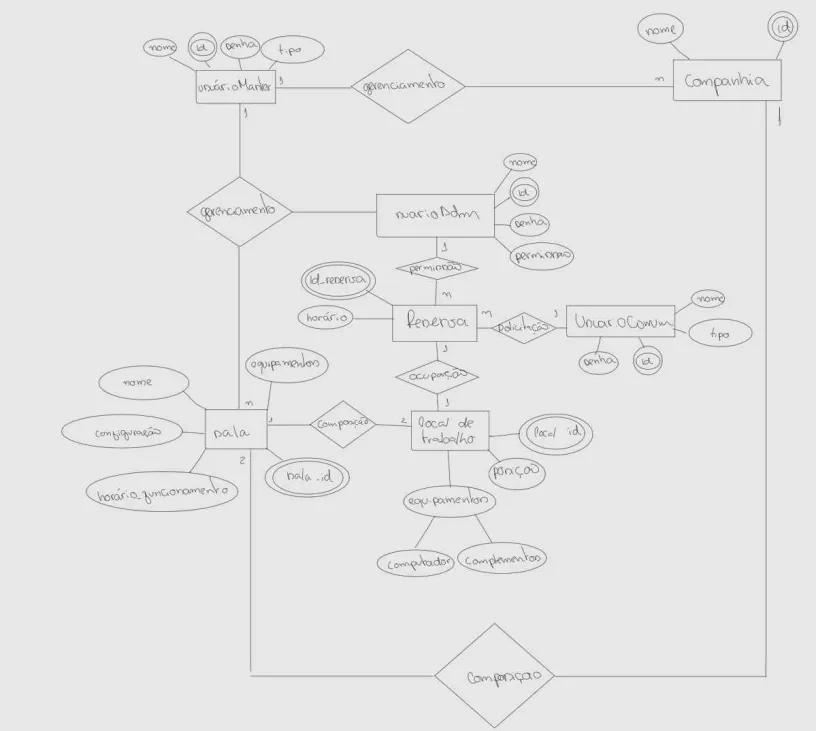

# Projeto Desenvolvimento Web

O projeto da disciplina será um sistema para organização do uso de espaços de trabalho em escritórios. As principais funcionalidades são:
1) Reserva de locais de trabalho em salas;
2) Visualização da agenda para os locais de trabalho;
3) Visualização dos equipamentos de cada local de trabalho, como computadores e monitores;
4) Criação e gerência das salas, com possibilidade de adição ou remoção de membros.

Para executar o projeto, inicialmente instale as dependências:

```
npm install
```

Para iniciar o servidor:

```
npm start
```

## Backend

Para executar o backend, inicialmente configure o ambiente:

```
npm init -y
npm install express dotenv pg mysql2 sequelize
npm install bcryptjs jsonwebtoken
npm install --save-dev typescript ts-node @types/node @types/express @types/dotenv
npm install --save-dev @types/bcryptjs @types/jsonwebtoken
```

O projeto utiliza banco de dados postgresql, então é preciso instalar e configurar, criando um usuário e um banco de dados. Com o postgresql, crie um arquivo .env no diretório base do projeto com as seguintes informações de acesso:

```
DB_DIALECT=postgres # ou mysql
DB_HOST=localhost
DB_PORT=5432 # 3306 para MySQL
DB_USER=db_user
DB_PASS=db_password
DB_NAME=db_name
JWT_SECRET=jwt_secret_key
```

Com a configuração concluída e o banco de dados executando, execute o backend com:

```
npm run dev
```

## Modelo Entidade-Relacionamento (MER)


